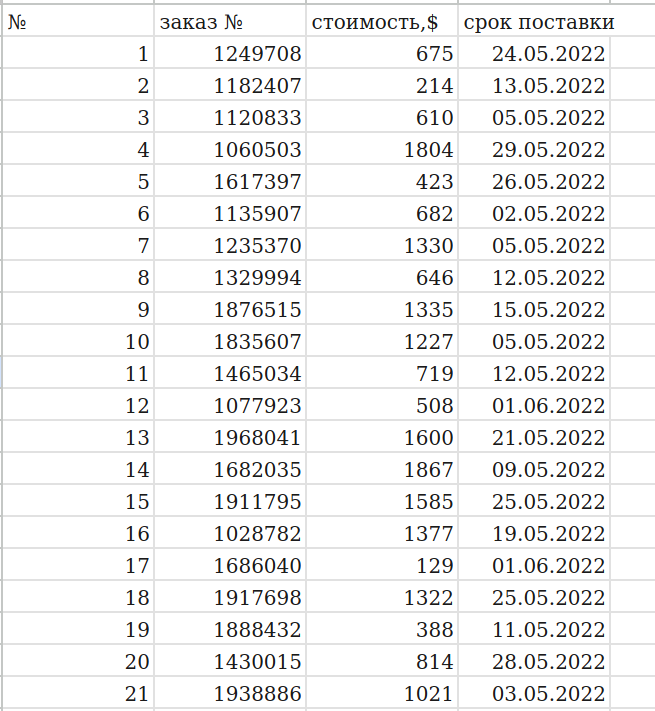

    

      
    

    

        
    

# Выполненое тестовое задание от Каналсервис

---

### Общая информация
* Проект реализован в Docker контейнере
* Переменные используемые в проекте задаются в файле _config.py_
* Проект запаскается командой 
>docker-compose up -d
* Доступ к [проекту](http://127.0.0.1:8083/pages/home) после запуска контейнера
* [Swagger документация](http://127.0.0.1:8083/docs)

---
Реализованный функционал:

1.Получение данныx из документа при помощи Google API, сделанного в Google Sheets следующего содержания:

2. Данные добавляться в СУБД на основе PostgreSQL, в том же виде, что и в файле –источнике, с добавлением
колонки &laquo;стоимость в руб.&raquo;, данные для перевода $ в рубли берутся по курсу ЦБ РФ.
3. Скрипт работает постоянно для обеспечения обновления данных в онлайн режиме 
(строки в Google Sheets таблице могут удаляться, добавляться и изменяться).
4. Реализована проверка соблюдения «срока поставки» из таблицы. В случае, если срок прошел, 
скрипт отправляет уведомление в Telegram.
5. Разработано одностраничное web-приложение на основе FastApi. Front-end: HTML, JS.
6. [Таблица для проверки](https://docs.google.com/spreadsheets/d/1obme_RCp5xUBj-Z5cEkYoEnyWZMp5I4ZvCL1WZMDyUQ/edit#gid=0)
предоставлен доступ пользователю _amkolotov@gmail.com_